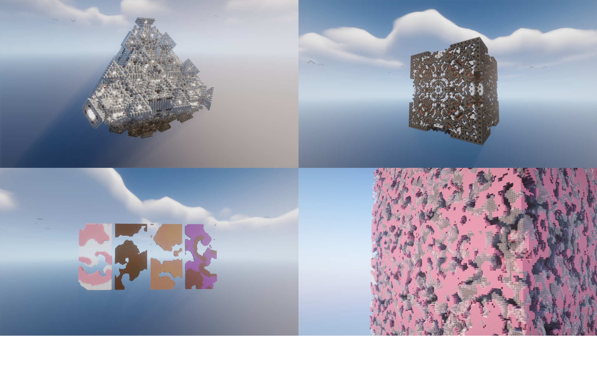

# 3D Automatons visualized in minecraft

The aim of this project is to visualize 3D cellular automatons in minecraft

## Dependencies:
To use this project you will need the following python libraries  installed:
	
* numba: https://numba.pydata.org/ -> to accelerate automaton processing
	* ``pip install numba``
* mcrcon: https://github.com/barneygale/MCRcon/ -> to run minecraft commands (used to copy the structure into the game)
	* ``pip install mcrcon``
* mcschematic: https://github.com/gwerneckp/minecraft-schematics -> to generate the minecraft schematic
	* ``pip install mcschematic``

You will also need a spigot, bukkit, paper, purpur or folia server to wich the structure will be copied
* Paper server (recommended): https://papermc.io/
	* how to get started: https://docs.papermc.io/paper/getting-started
* Schematic utility: https://github.com/ImagineeringParks/schematic-utility -> This is the minecraft plugin used to copy the schematic in your world, you  will need to put the downloaded .jar file in the plugin folder of your server
* Fast Asynchronous World Edit: https://github.com/IntellectualSites/FastAsyncWorldEdit -> a world editing minecraft plugin, is a dependency of Schematic utility, install it the same way as the Schematic utility

## Run the project:
You need to download the repository or clone it, but you will need to make a few modifications to the code for it to run properly:
* Unless you create a world in your server named ``'auto'`` you will need to change the code to change the world name to ``'world'`` (at the start of the code) for this to work
* The PATH variable at the start of the code describes the path in wich the schematics will be put, this needs to be ``"[path to your server]/plugins/FastAsyncWorldEdit/schematics"``, don't forget to replace the ``/`` with ``\`` if you are on windows
* In the ``server.properties`` file of your minecraft server, you will need to enable RCON to allow the program to connect to your server, to do that simply change the line ``enable-rcon=false`` in ``server.properties`` to  ``enable-rcon=true``. You will also need to choose a password (``rcon.password=[your password]``), then in the python code you will need to change the line ``RCON_PASSWORD = 'test'`` to be the password you put in the ``server.properties``
* you can then cd into the directory where you put the python code and execute the code using ``python automaton.py``, by default it will create a cloud cellular automaton at coordinates 0,100,0 and a rock paper scissors automaton besides it.